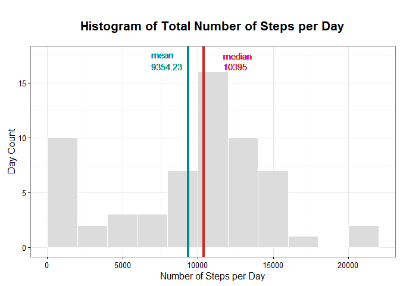
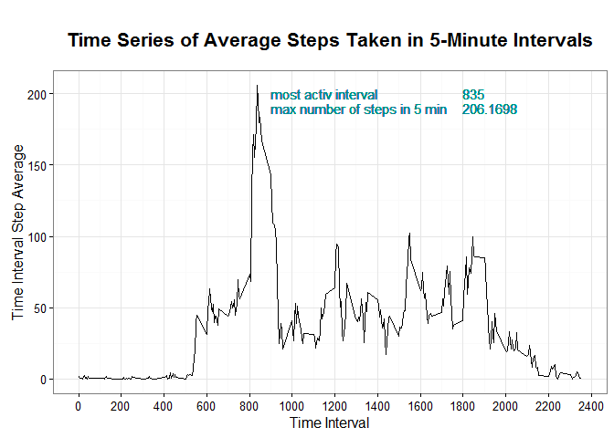
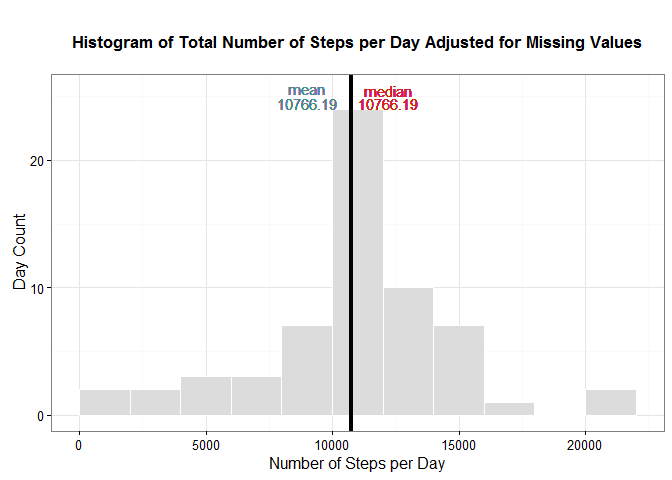
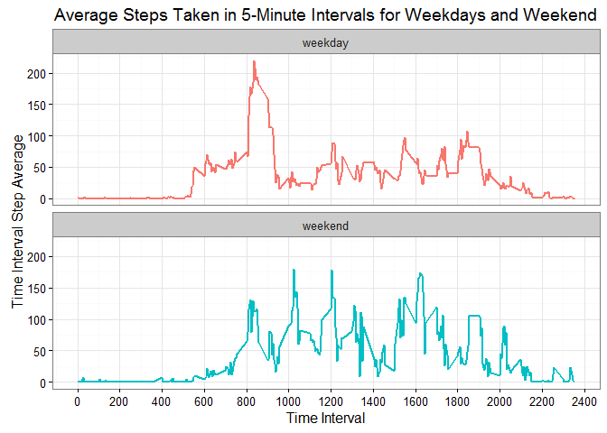

**Reproducible Research - Project Assignment 1 **
==================================================

###**Tihana Mirkovic**
###### Friday, September 2, 2016  


##**1.1 Introduction**

In this assignment, a dataset, "activity monitoring data" provided on the course website, was analyzed. The data was collected from a personal activity monotoring device, which recorded the steps taken at 5 minute intervals for 24 hours, over a period of two months, during October and November of 2012. The analysis presented here, includes histograms with total number of steps taken per day, but also compares the activity of the individual on weekdays and weekends. 

As an assignment for the Coursera course on Reproducible Research, the goal was to write the whole report in one R markdown document which was subsequently processed through knitr producing the final HTML file. 
<p></br></p>

####**1.2 R Document Set Up**

- The necessary libraries for analysis and graphing were loaded.
- Also, `echo = TRUE` has been selected for all the code chunks, so that they are visible to reviewers.
 


```r
library(knitr)
opts_chunk$set(echo = TRUE)
library(ggplot2)
library(dplyr)
```

```
## 
## Attaching package: 'dplyr'
```

```
## The following objects are masked from 'package:stats':
## 
##     filter, lag
```

```
## The following objects are masked from 'package:base':
## 
##     intersect, setdiff, setequal, union
```
  
<p></br></p>
    
####**1.3 Loading the Data and Initial Data Check**  

The file, `activity.csv`, provided through the [link](https://d396qusza40orc.cloudfront.net/repdata%2Fdata%2Factivity.zip) on the course website, was downloaded into the working directory, and using `read.csv()` was read into R.


```r
data_steps<-read.csv("./activity.csv")
```
<p></br></p>

To get an idea for the data `head()`, `str()`, and `summary()` were used, highlighting some of the properties of the three variables included in the data set:  

*  **steps**: Number of steps taking in a 5-minute interval (missing values are coded as NA)  
*  **date**: The date on which the measurement was taken in YYYY-MM-DD format    
*  **interval**: Identifier for the 5-minute interval in which measurement was taken      
<p></br></p>


```r
head(data_steps)
```

```
##   steps       date interval
## 1    NA 2012-10-01        0
## 2    NA 2012-10-01        5
## 3    NA 2012-10-01       10
## 4    NA 2012-10-01       15
## 5    NA 2012-10-01       20
## 6    NA 2012-10-01       25
```


```r
str(data_steps)
```

```
## 'data.frame':	17568 obs. of  3 variables:
##  $ steps   : int  NA NA NA NA NA NA NA NA NA NA ...
##  $ date    : Factor w/ 61 levels "2012-10-01","2012-10-02",..: 1 1 1 1 1 1 1 1 1 1 ...
##  $ interval: int  0 5 10 15 20 25 30 35 40 45 ...
```


```r
summary(data_steps)
```

```
##      steps                date          interval     
##  Min.   :  0.00   2012-10-01:  288   Min.   :   0.0  
##  1st Qu.:  0.00   2012-10-02:  288   1st Qu.: 588.8  
##  Median :  0.00   2012-10-03:  288   Median :1177.5  
##  Mean   : 37.38   2012-10-04:  288   Mean   :1177.5  
##  3rd Qu.: 12.00   2012-10-05:  288   3rd Qu.:1766.2  
##  Max.   :806.00   2012-10-06:  288   Max.   :2355.0  
##  NA's   :2304     (Other)   :15840
```
<p></br></p>


###**2. Analysis With Initial Data Set**  

Below, analysis of the data will be presented that leads to the answers of the questions posed in the assignment.
<p></br></p>
####**2.1 The Total Number of Steps Taken Each Day**     


#####**2.1.1 Analysis**
To determine the total number of steps taken each day, as well as the mean and median number of steps taken each day, two steps had to be performed first:  

* the data had to be grouped by `date` using `group_by` 
* the grouped data had to be summarized by the `sum` of `steps` using `summarize`


```r
data_days<-group_by(data_steps, date)
sum_days<-summarize(data_days, total_steps=sum(steps, na.rm=TRUE))
mean_steps_per_day<-mean(sum_days$total_steps)
median_steps_per_day<-median(sum_days$total_steps)

summary(sum_days$total_steps, digits=5)
```

```
##    Min. 1st Qu.  Median    Mean 3rd Qu.    Max. 
##     0.0  6778.0 10395.0  9354.2 12811.0 21194.0
```
The `summary` function provides us with the mean and median values.
<p></br></p>

#####**2.1.2 Plot**
`ggplot` was used to produce a histogram, also highlighting the position of the `mean` and the `median` of the data. 


```r
g1<-ggplot(sum_days, aes(x=total_steps))+
        geom_histogram(breaks = seq(0,22000,by=2000), colour="white", fill="gainsboro")+
        theme_bw()+
        geom_vline(xintercept = mean(sum_days$total_steps), colour="darkcyan", lwd=1.5)+
        geom_vline(xintercept = median(sum_days$total_steps), colour="firebrick3", lwd=1.5)+
        geom_text(label=mean_steps_per_day, aes(x=6900, y=16.5, label=V1), size=4, parse=T, 
        colour="darkcyan", hjust = 0)+
        geom_text(label="mean", aes(x=6900, y=17.5, label=V1), size=4, parse=T, colour="darkcyan",hjust = 0)+
        geom_text(label=median_steps_per_day, aes(x=11700, y=16.5, label=V1), size=4, 
        parse=T, colour="firebrick3",hjust = 0)+
        geom_text(label="median", aes(x=11700, y=17.5, label=V1), size=4, parse=T, colour="firebrick3",hjust = 0)+
        xlab("Number of Steps per Day")+
        ylab("Day Count")+ 
        ggtitle("Histogram of Total Number of Steps per Day")+ 
        theme(plot.title = element_text(size=16, face="bold", margin=margin(20,0,20,0)))
g1
```

<!-- -->


<p></br></p>
####**2.2 Time Series Plot of Average Number of Steps Taken**

#####**2.2.1 Analysis**

To be able to produce the time series plot of the average number of steps taken during each time interval (averaged over all days) and to determine the most active time interval, a couple of data transformation steps were performed:

* using `group_by` the data from the previous section was grouped by interval 
* using `summarize` the average number of steps per time interval were obtained
* using `max` and `filter` the most active time interval and the maximum number of steps in a 5-min interval were extracted


```r
time_interval<-group_by(data_steps, interval)
average_time_interval<-summarize(time_interval, interval_average=mean(steps, na.rm=TRUE))    

highest_interval_average<-max(average_time_interval$interval_average)
most_active_interval_subset<-filter(average_time_interval,interval_average==max(interval_average))
most_active_interval<-most_active_interval_subset$interval

print (c("The most active interval is ", most_active_interval, "with the maximum number of steps at ", highest_interval_average))
```

```
## [1] "The most active interval is "        
## [2] "835"                                 
## [3] "with the maximum number of steps at "
## [4] "206.169811320755"
```
<p></br></p>
#####**2.2.2 Plot**
`ggplot` was used to produce a time series plot, also highlighting the most active time interval and the corresponding maximum average number of steps during that interval.

```r
g2<-ggplot(average_time_interval, aes(interval, interval_average))+geom_line(size=0.65) +
        ylab("Time Interval Step Average")+xlab("Time Interval")+
        scale_x_continuous(breaks=seq(0,2400,by=200))+
        theme_bw()+
        geom_text(label="most activ interval", aes(x=900, y=200, label=V1), size=4, colour="darkcyan",
        hjust = 0)+
        geom_text(label=most_active_interval, aes(x=1800, y=200, label=V1), size=4, parse=T, 
        colour="darkcyan",hjust = 0)+
        geom_text(label="max number of steps in 5 min", aes(x=900, y=190, label=V1), size=4, 
        colour="darkcyan",hjust = 0)+
        geom_text(label=highest_interval_average, aes(x=1800, y=190, label=V1), size=4, parse=T, 
        colour="darkcyan",hjust = 0)+ 
        ggtitle("Time Series of Average Steps Taken in 5-Minute Intervals")+ 
        theme(plot.title = element_text(size=16, face="bold", margin=margin(20,0,20,0)))
g2
```

<!-- -->
<p></br></p>

###**3. Analysis Taking Into Account Missing Data**  

A number of days and intervals in the original data set contained missing values (NAs). 

####**3.1 Total Number of NAs** 
In this section the total number of NAs in the original data set is calculated.


```r
number_of_NAs<-sum(is.na(data_steps$steps))
number_of_NAs
```

```
## [1] 2304
```
The number of missing values is 2304.
<p></br></p>

####**3.2 Repopulation of NA Fields in the Original Data Set** 

The new data set is created, where the mean of each 5-minute interval, previously calculated, is introduced into the corresponding NA-field. The following steps were taken:

* A new data set was copied.
* All rows that contain NA values in the "steps" column were determined
* All the corresponding time intervals of the columns with missing steps were determined
* The averages of the corresponding time intervals were inputted into the NA values of the original data set

A number of for-loops has been used to perform this task, but I am sure there are more efficient ways of doing this.


```r
new_step_data<-data_steps

all_NA<-which(is.na(new_step_data$steps))

b_all_NA_tframes_spot<-all_NA%%288
for (i in 1:length(b_all_NA_tframes_spot)){
        if( b_all_NA_tframes_spot[i]==0)
        b_all_NA_tframes_spot[i]=288
}

a_all_NA_tframes_averages<-b_all_NA_tframes_spot
c_just_interval_average<-average_time_interval$interval_average

for (i in 1:length(b_all_NA_tframes_spot)){
        a_all_NA_tframes_averages[i]<-c_just_interval_average[b_all_NA_tframes_spot[i]]
}

data_steps_fixed<-data_steps

for (i in 1:length(all_NA)){
        data_steps_fixed[all_NA[i],1]<-a_all_NA_tframes_averages[i]
}
```

To check that all the fields have been populated, we calculated the number of NA values in the new data set:

```r
sum(is.na(data_steps_fixed$steps))
```

```
## [1] 0
```

<p></br></p>


####**3.3 The Total Number of Steps Taken Each Day Including Missing Values** 
#####**3.3.1 Analysis**
Just like in section, 2.1.1, to determine the total number of steps taken each day including missing values, as well as the mean and median number of steps taken each day, two steps had to be performed first:  

* the data had to be grouped by `date` using `group_by` 
* the grouped data had to be summarized by the `sum` of `steps` using `summarize`


```r
data_days2<-group_by(data_steps_fixed, date)

sum_days2<-summarize(data_days2, total_steps2=sum(steps, na.rm=TRUE))
summary(sum_days2$total_steps2, digits=5)
```

```
##    Min. 1st Qu.  Median    Mean 3rd Qu.    Max. 
##      41    9819   10766   10766   12811   21194
```

```r
mean_steps_per_day2<-mean(sum_days2$total_steps2)
mean_steps_per_day2
```

```
## [1] 10766.19
```

```r
median_steps_per_day2<-median(sum_days2$total_steps2)
median_steps_per_day2
```

```
## [1] 10766.19
```
Both, the mean and the median were evaluated at 10766 steps for the data set with missing values adjusted. The values have both increased compared to the mean and median of the data set where missing values were omitted.

<p></br></p>

#####**3.3.2 Plot**
`ggplot` was used to produce a histogram, also highlighting the position of the `mean` and the `median` of the data. 

```r
g3<-ggplot(sum_days2, aes(x=total_steps2))+
        geom_histogram(breaks = seq(0,22000,by=2000), colour="white", fill="gainsboro")+
        theme_bw()+
        geom_vline(xintercept = mean(sum_days2$total_steps2), colour="black", lwd=1.5)+
        geom_vline(xintercept = median(sum_days2$total_steps2), colour="black", lwd=1.5)+
        geom_text(label=mean_steps_per_day2, aes(x=9000, y=24.5, label=V1), size=4, parse=T, 
        colour="cadetblue4")+
        geom_text(label="mean", aes(x=9000, y=25.5, label=V1), size=4, parse=T, colour="cadetblue4")+
        geom_text(label=median_steps_per_day2, aes(x=12200, y=24.5, label=V1), size=4, parse=T, 
        colour="firebrick3")+
        geom_text(label="median", aes(x=12200, y=25.5, label=V1), size=4, parse=T, colour="firebrick3")+
        xlab("Number of Steps per Day")+
        ylab("Day Count")+
        ggtitle("Histogram of Total Number of Steps per Day Adjusted for Missing Values")+ 
        theme(plot.title = element_text(size=13, face="bold", margin=margin(20,0,20,0)))
g3
```

<!-- -->
<p></br></p>


####**3.4 Are there differences in activity patterns between weekdays and weekends?** 
The final analysis was done on the edited data set from section 3.2 to check for the activity pattern between weekdays and weekends. 
<p></br></p>
#####**3.4.1 Analysis**
To extract the desired information from the data set, a few modifications were required:

* The class of the `date` column was changed using `as.Date`
* A new column `day` was added to the data set, which is a factor variable with two levels - **weekday** and **weekend**


```r
data_steps_weekday_weekends<-data_steps_fixed
data_steps_weekday_weekends$date<-as.Date(data_steps_weekday_weekends$date)
data_steps_weekday_weekends<-cbind(day = "week", data_steps_weekday_weekends)
data_steps_weekday_weekends$day<-factor(data_steps_weekday_weekends$day, levels=c("weekday", "weekend"))
```

* Using the `weekdays` function, all the dates were checked if they are weekend or weekday and the appropriate level was noted in the `day` column


```r
for (i in 1:17568){
        if(weekdays(data_steps_weekday_weekends[i,3])=="Saturday")
                data_steps_weekday_weekends[i,1]="weekend"
        if(weekdays(data_steps_weekday_weekends[i,3])=="Sunday")
                data_steps_weekday_weekends[i,1]="weekend"
        else
                data_steps_weekday_weekends[i,1]="weekday"
}
```

* Finally, the data was subsetted by `interval` and `day` and the summary was performed according to the average of the steps taken by interval and subsetted into weekends/weekdays 


```r
data_steps_weekday_weekends1<-data_steps_weekday_weekends
time_interval_gr<-group_by(data_steps_weekday_weekends1, interval, day)
average_time_interval_days<-summarize(time_interval_gr, avg_steps_days=mean(steps, na.rm=TRUE))
head(average_time_interval_days)
```

```
## Source: local data frame [6 x 3]
## Groups: interval [3]
## 
##   interval     day avg_steps_days
##      <int>  <fctr>          <dbl>
## 1        0 weekday     1.94375222
## 2        0 weekend     0.21462264
## 3        5 weekday     0.38447846
## 4        5 weekend     0.04245283
## 5       10 weekday     0.14951940
## 6       10 weekend     0.01650943
```

<p></br></p>
#####**3.4.2 Plot**
`ggplot` with `facet_wrap` was used to create the penal plot of the time series for the two subgroups: weekend and weekday. 

```r
g4<-ggplot(average_time_interval_days, aes(interval, avg_steps_days))+
        geom_line(aes(colour=day), size=0.8 )+
        ylab("Time Interval Step Average")+xlab("Time Interval")+
        facet_wrap(~day, ncol=1)+
        scale_x_continuous(breaks=seq(0,2400,by=200))+
        theme(strip.text.x = element_text(size = 12))+
        ggtitle("Average Steps Taken in 5-Minute Intervals for Weekdays and Weekend")+ 
        theme(plot.title = element_text(size=14, face="bold", margin=margin(25,0,25,0)))+
        theme_bw()+
        theme(legend.position="none")
g4
```

<!-- -->

<p></br></p>
The graph suggest a different pattern during the week, compared to the weekends. During the week, the subject is more active in the morning hours, but then the activity drops off during the day. On the weekend, the subject is more active throughout the day. One of the reasons might be that during the week, the subject has a more sedentary job and thus a lower activity during the day. 
